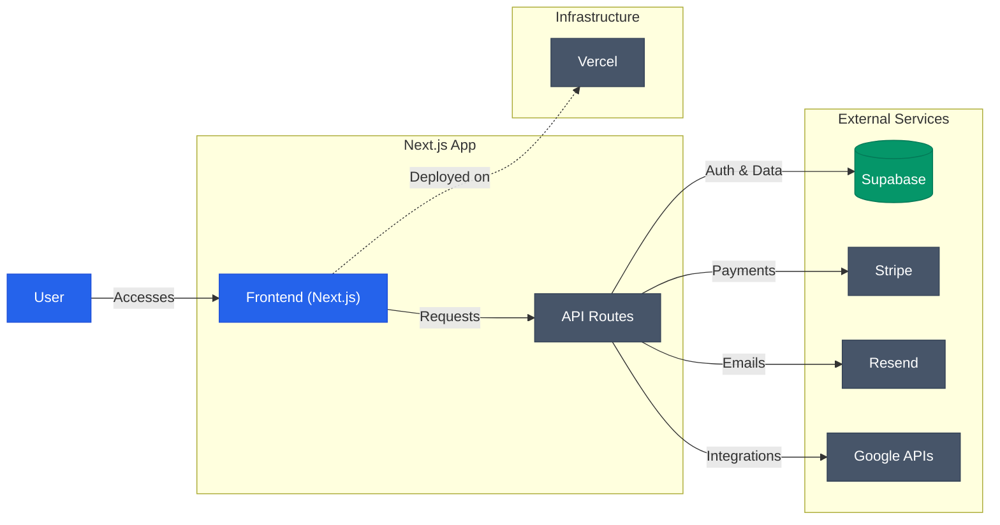

  
  <h1>Welcome to Sheetful</h1>
  

    
    &nbsp;
    
  

We focus on building modern and scalable solutions using the latest tech stack. Our flagship project, **Sheetful**, reflects our commitment to quality and performance.

---

## Tech Stack & Tools

---

## Project Architecture

Below is a simplified flow of how our applications are structured, integrating authentication, payments, and external services.

---

## Featured Projects

### Sheetful
Turn your Google Sheets into powerful REST APIs in seconds.
- **Instant APIs**: GET, POST, PUT, DELETE endpoints generated automatically.
- **Secure**: Authentication and role-based access control.
- **Scalable**: Built on top of Supabase and Vercel.

---

## Contact

Feel free to explore our repositories and contribute!

